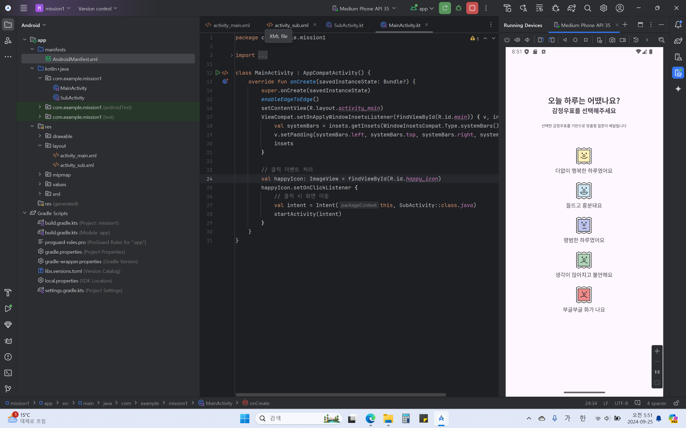
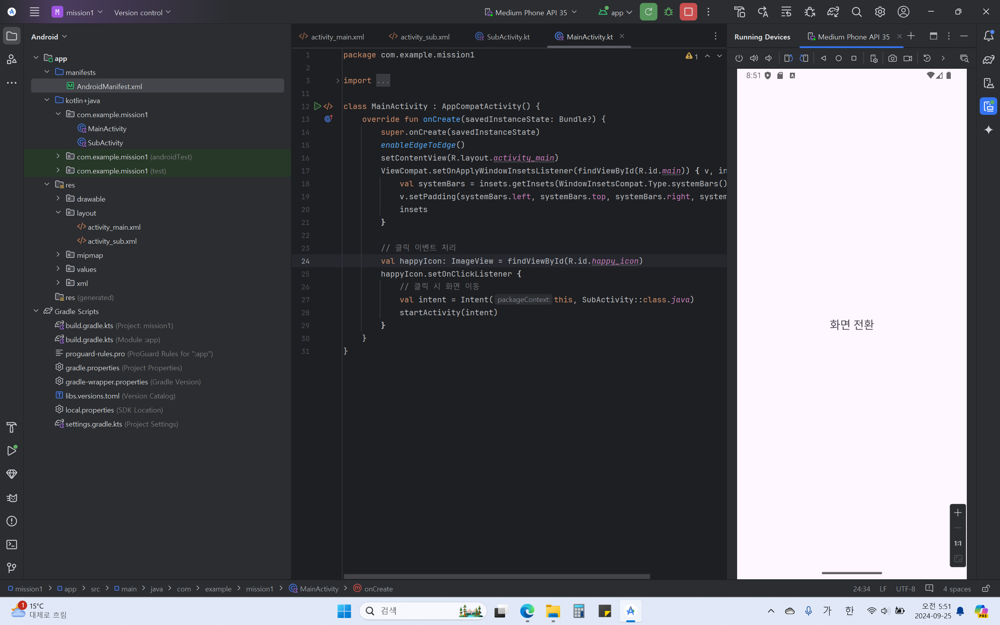

# Chapter 1 - Platform & Layout
## ⚡️안드로이드 개발 과정
1. 프로젝트 생성
2. 화면 디자인 및 편집
3. 코틀린 코드 작성 및 수정
4. 프로젝트 실행 및 결과 확인

* activity_main.xml : 기본 액티비티, 애플리케이션을 동작할 때 이루어지는 화면
* MainActivity.kt : 메인 코틀린 코드, 액티비티에서 이루어지는 소스 파일
* AndroidManifest.xml : 애플리케이션의 기본적인 정보가 저장된 설정 파일
* GradleScripts : Gradle 빌드 시스템과 관련된 파일
* drawable : 애플리케이션에서 사용할 이미지 파일 저장 디렉터리

## ⚡️안드로이드 4대 컴포넌트
안드로이드 애플리케이션을 구성하는 데 필요한 4가지 요소로 다음과 같은 공통적인 특징을 지님
* 독립적인 형태로 존재
* 고유한 기능을 수행
* 인텐트를 통해 상호 작용  
  → Intent (인텐트) : 컴포넌트 간의 작업 수행을 위한 정보를 전달하는 역할

1. Activity (액티비티)
 : 사용자에게 실제로 보이는 화면, 적어도 하나 이상의 액티비티가 필요
1. Service (서비스)
 : 백그라운드에서 어떠한 작업을 처리하기 위해 주로 사용
1. BroadCast Receiver (방송 수신자)
 : 안드로이드 OS로부터 발생하는 각종 이벤트와 정보를 받아 핸들링
1. Content Provider (콘텐츠 제공자)
 : 데이터를 관리하고 특정 애플리케이션이 사용하고 있는 데이터베이스를 공유하기 위해 사용

## ⚡️안드로이드 뷰
UI를 구성하는 데 사용되며 안드로이드 애플리케이션을 실행했을 때 화면에 보이는 모든 요소 ex) 버튼, 입력창 등
* Widget (위젯) : 뷰 객체, 화면에 보이는 각 요소들
* Layout (레이아웃) : 뷰 그룹 객체, 뷰를 화면에 배치하기 위한 역할

## ⚡️AVD (Android Virtual Device)
안드로이드 가상 기기, 다양한 기기와 안드로이드 버전에서 개발한 애플리케이션을 테스트하는 데 사용

## 📂실습 인증

